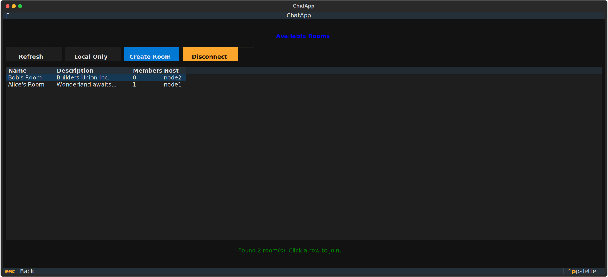
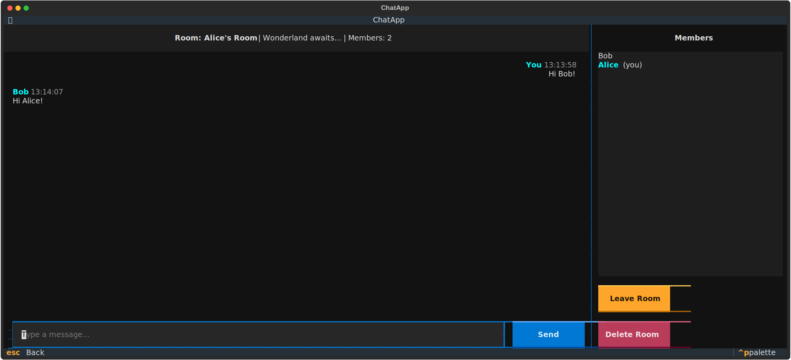
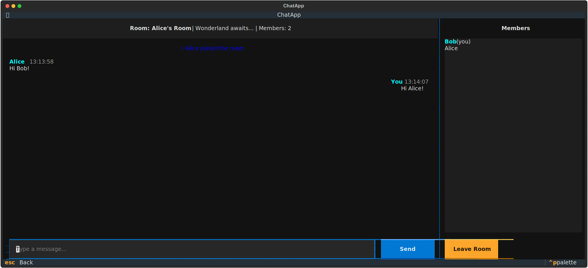

[](https://deepwiki.com/ds-g1-sms/node)

# Distributed Chat System - Node

A distributed peer-to-peer chat system built with Python, XML-RPC, and
WebSockets.

## Overview

This repository contains the implementation of a distributed chat node that
participates in a peer-to-peer messaging network. Each node can host chat rooms,
handle client connections, and communicate with other nodes to provide a
distributed chat service.

## Screenshots





## Architecture

See [docs/architecture.md](docs/architecture.md) for detailed architecture
documentation and [docs/terms.md](docs/terms.md) for terminology reference.

### Key Features

- **Distributed Architecture**: All nodes are equal peers with no central
  authority
- **Dynamic Room Management**: Create, join, and delete rooms across the network
- **Global Room Discovery**: Find rooms hosted on any node in the network
- **Administrator-Based Ordering**: Room creator assigns sequence numbers for
  message ordering
- **XML-RPC Communication**: Server-to-server communication with message
  forwarding and broadcasting
- **WebSocket Clients**: Real-time bidirectional client-server messaging
- **Terminal UI**: Rich terminal-based user interface built with Textual
- **Two-Phase Commit**: Coordinated room deletion across distributed nodes
- **Fault Tolerance**: Heartbeat monitoring, disconnect detection, and automatic
  member cleanup
- **Modular Architecture**: Reusable schemas and utilities for maintainability

## Quick Start

### Using Docker (Recommended)

1. **Start the nodes:**

   ```bash
   docker compose up -d
   ```

   This starts 3 distributed chat nodes accessible at:

   - Node 1: `localhost:8081`
   - Node 2: `localhost:8082`
   - Node 3: `localhost:8083`

2. **Run the chat client locally:**

   ```bash
   poetry install
   poetry run chat-client
   ```

3. **Connect to a node:**

   - Enter your username
   - Enter a node address (e.g., `localhost:8081`)
   - Click "Connect"

4. **View node logs:**

   ```bash
   docker compose logs -f
   ```

5. **Stop the nodes:**

   ```bash
   docker compose down
   ```

### Running Without Docker

1. **Install dependencies:**

   ```bash
   poetry install
   ```

2. **Start a node server (in one terminal):**

   ```bash
   poetry run python -m src.node.main
   ```

3. **Start the chat client (in another terminal):**

   ```bash
   poetry run chat-client
   ```

4. **Connect to the node:**

   - Enter your username
   - Enter `localhost:8080` as the node address
   - Click "Connect"

## Project Structure

```
.
├── src/
│   ├── node/           # Node server
│   │   ├── main.py              # Node entry point
│   │   ├── room_state.py        # Room state management
│   │   ├── websocket_server.py  # WebSocket server for clients
│   │   ├── xmlrpc_server.py     # XML-RPC server for peer communication
│   │   ├── peer_registry.py     # Peer node registry
│   │   ├── schemas/             # Standardized data structures
│   │   │   ├── messages.py      # Message schemas
│   │   │   ├── events.py        # Event schemas
│   │   │   └── responses.py     # Response schemas
│   │   └── utils/               # Utility functions
│   │       ├── broadcast.py     # Peer broadcasting
│   │       └── validation.py    # Input validation
│   └── client/         # Chat client
│       ├── main.py              # Client entry point
│       ├── chat_client.py       # WebSocket client with message ordering
│       ├── service.py           # Client service layer
│       ├── protocol.py          # Message protocols
│       ├── message_buffer.py    # Message ordering buffer
│       ├── schemas/             # Client data structures
│       │   ├── base.py          # Base schemas
│       │   ├── member.py        # Member schemas
│       │   ├── message.py       # Message schemas
│       │   └── room.py          # Room schemas
│       └── ui/                  # Terminal UI (Textual)
│           └── app.py           # Main UI application
├── tests/              # Test files
├── docs/               # Documentation
│   ├── architecture.md # System architecture
│   └── terms.md        # Terminology reference
├── deployment/         # Deployment configurations
│   ├── docker-compose.dev.yml   # Development setup
│   ├── docker-compose.prod.yml  # Production setup
│   ├── docs/           # Deployment documentation
│   └── scripts/        # Deployment scripts
└── docker-compose.yml  # Docker Compose for multi-node setup
```

## Development

### Prerequisites

- Python 3.8 or later
- Poetry - Python package manager
- Docker & Docker Compose - for multi-node deployment

### Installing

```bash
# Using Make (recommended)
make install

# Or using Poetry directly
poetry install
```

### Testing

```bash
# Using Make
make test

# Or using Poetry directly
poetry run pytest -v
```

### Linting & Formatting

```bash
# Run linters
make lint

# Format code
make format
```

### Docker Commands

```bash
# Build Docker images
make docker-build

# Start all nodes
make docker-up

# View logs
docker compose logs -f

# Stop nodes
make docker-down

# Clean up (remove containers, volumes, and images)
make docker-clean
```

**Note**: Docker builds use a `requirements.txt` file generated from
`pyproject.toml`.

## Chat Client Usage

The chat client provides a terminal-based user interface with the following
features:

### Connection Screen

- Enter your username
- Enter node address (e.g., `localhost:8081`)
- Click "Connect" or press Enter

### Room List Screen

- View available rooms (local or global discovery)
- Create new rooms
- Join rooms by clicking on them
- Refresh the room list

### Chat Screen

- Send and receive messages
- View member list
- See system notifications (joins, leaves, errors)
- Leave room to return to room list

### Keyboard Shortcuts

- `q` - Quit the application
- `Escape` - Go back / Cancel
- `r` - Refresh room list

## Technology Stack

- **Language**: Python
- **Server-to-Server**: XML-RPC
- **Client-to-Server**: WebSockets
- **Terminal UI**: Textual
- **State Management**: In-memory

## Contributing

This is a course project for distributed systems. See architecture documentation
for design decisions and trade-offs.

## License

[Specify license here]
